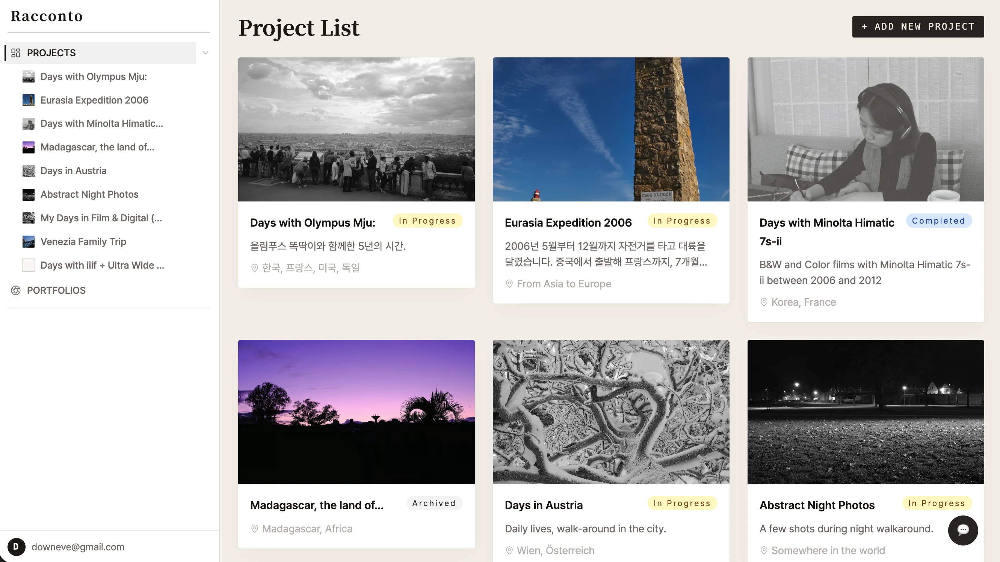
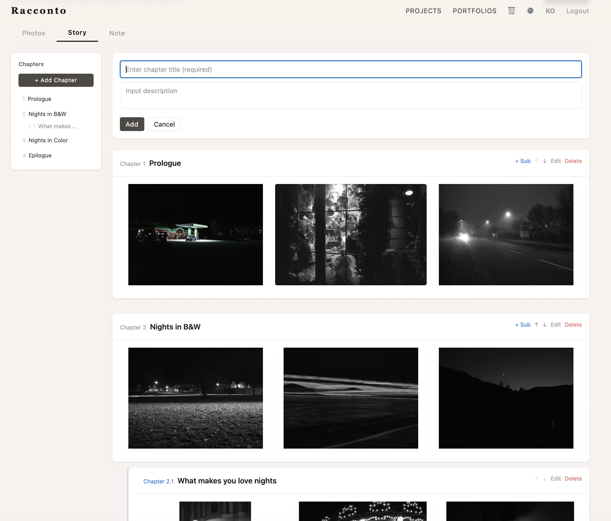
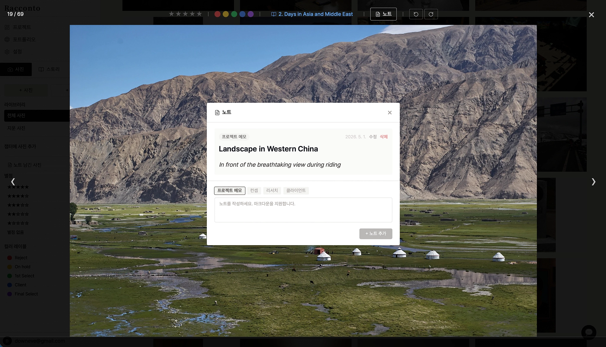
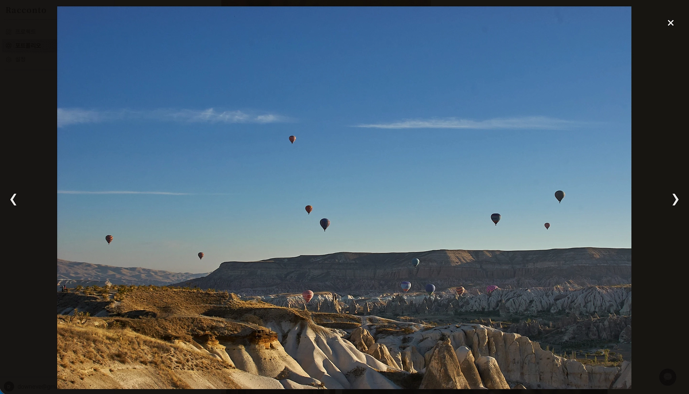
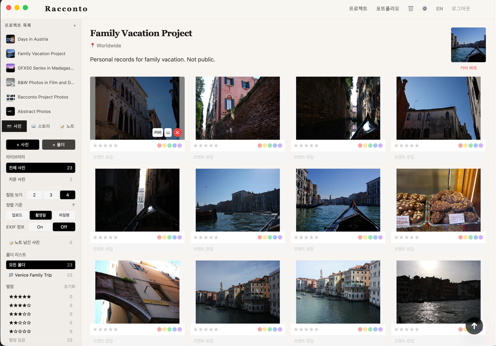

# Racconto

> **Tell your story through photos — without Lightroom, without expensive tools.**

---

<!-- Main screenshot -->

---

## What is Racconto?

Racconto is a **photo storytelling tool and portfolio platform** for anyone who takes photos — phone, film, or digital. Organize your shots into chapters, build a public portfolio, and share your story — all without heavy software.

Built for everyone who loves photography.

---

## Features

### 🗂 Story Builder
Organize photos into projects with chapters and sub-chapters. Drag to reorder. Filter by star rating or color label.

### 🖼 Notes support Markdown
Concept, idea and any memo notes with Markdown support related to projects and photos.

### 🌐 Public Portfolio & Lightbox
One-click public portfolio at `/p/your-username`. Share your work with a clean, distraction-free URL. Full-screen lightbox with automatic EXIF extraction.

### 💻 Electron Desktop App
Auto-watch folders and upload photos in the background. Works offline with an upload queue.

---

## Tech Stack

| Layer | Technology |
|---|---|
| Backend | FastAPI (Python) + PostgreSQL (Docker) |
| Frontend | React + Vite + TypeScript + Tailwind CSS |
| Images | Cloudflare Images (WebP auto-convert, 2400px resize) |
| Auth | JWT + bcrypt + Email verification (Brevo) |
| Desktop | Electron 41 (macOS / Windows) |
| i18n | react-i18next (Korean / English) |
| Deploy | Linode + Nginx + systemd + Let's Encrypt |

---

## Live Demo

👉 [racconto.app](https://racconto.app)

Open beta coming soon. Sign up to be an early tester.

---

## License

This project is **source-available**, not open source.

Licensed under [MIT](https://opensource.org/licenses/MIT) with [Commons Clause](https://commonsclause.com/).

> You may view and fork this code for personal, non-commercial use.  
> **Commercial use, resale, and redistribution are prohibited.**

© 2026 Dawoon Choi. All rights reserved.

---

---

# Racconto (한국어)

> **Lightroom 없이도, 비싼 툴 없이도 — 당신의 사진으로 이야기를 만드세요.**

---

## Racconto란?

Racconto는 사진 찍는 누구나 쉽게 이야기를 만들 수 있는 **사진 프로젝트 관리 + 포트폴리오 플랫폼**입니다.  
핸드폰, 필름, 디지털 — 어떤 카메라로 찍든 상관없어요.

사진을 챕터로 구성하고, 퍼블릭 포트폴리오를 만들고, 당신의 이야기를 세상에 공유하세요.

---

## 주요 기능

### 📁 스토리 빌더 및 사진 관리
챕터/서브챕터 구조로 서사 구성하기. 드래그로 순서 변경, 별점/컬러 레이블로 손쉬운 필터링 및 관리.

### 🖼 자유로운 메모 작성
사진과 연계된 마크다운 노트(컨셉, 메모, 리서치 등 모든 아이디어를 기록) 지원.

### 🌐 퍼블릭 포트폴리오 및 라이트박스
`/p/유저명` 주소로 깔끔한 포트폴리오 공개. 전체 화면 라이트박스와 자동 EXIF 추출. 

### 💻 Electron 데스크톱 앱
프로젝트 연결 폴더 자동 감시 + 백그라운드 업로드. 오프라인 큐 지원.

---

## 기술 스택

| 분류 | 스택 |
|---|---|
| 백엔드 | FastAPI (Python) + PostgreSQL (Docker) |
| 프론트엔드 | React + Vite + TypeScript + Tailwind CSS |
| 이미지 | Cloudflare Images (WebP 자동 변환, 장변 2400px) |
| 인증 | JWT + bcrypt + 이메일 인증 (Brevo) |
| 데스크톱 | Electron 41 (macOS / Windows) |
| 다국어 | react-i18next (한국어 / 영어) |
| 배포 | Linode + Nginx + systemd + Let's Encrypt |

---

## 라이브 데모

👉 [racconto.app](https://racconto.app)

오픈 베타 준비 중입니다. 테스터 모집 예정.

---

## 라이선스

이 프로젝트는 **소스 공개(source-available)** 방식으로, 오픈소스가 아닙니다.

[MIT](https://opensource.org/licenses/MIT) + [Commons Clause](https://commonsclause.com/) 라이선스 적용.

> 개인 비상업적 목적으로는 코드를 열람하고 포크할 수 있습니다.  
> **상업적 사용, 재판매, 재배포는 금지됩니다.**

© 2026 Dawoon Choi. All rights reserved.