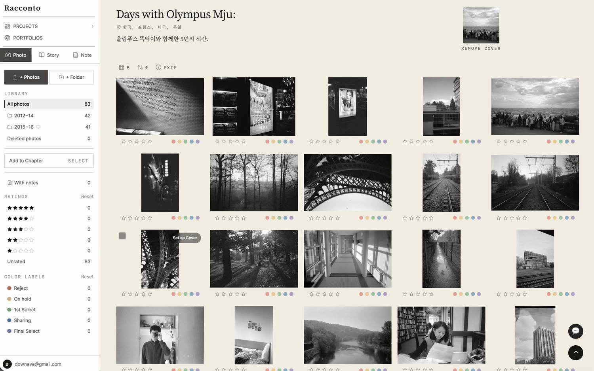
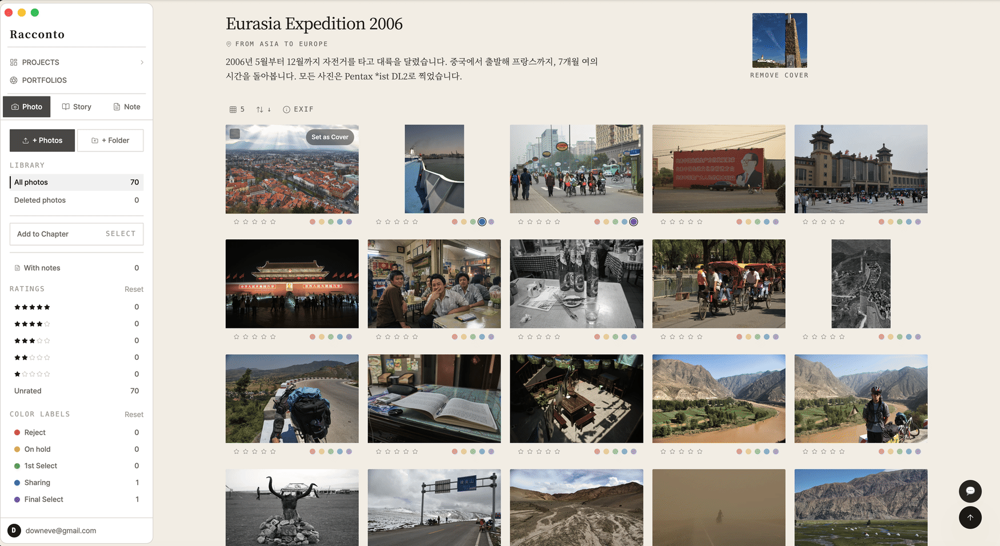

# Racconto

> **Tell your story through photos — without Lightroom, without expensive tools.**

---

<!-- Main screenshot -->

---

## Quick Start

1. Sign up at [racconto.app](https://racconto.app)
2. Create a project → add photos → organize into chapters
3. Publish your portfolio → share `racconto.app/your-username`

---

## Why I built this

Most photo tools force a choice: heavy editing software (Lightroom, Capture One) or simple sharing (Instagram, Google Photos). Neither lets you tell the *story behind* a shoot — the context, the sequence, the intent.

Racconto is for photographers who think in projects, not feeds. Film photographers documenting a roll. Wedding photographers sharing a curated story with clients. Hobbyists who want a clean portfolio without an Adobe subscription.

I built it because I wanted it myself.

---

## What is Racconto?

Racconto is a **photo storytelling tool and portfolio platform** for anyone who takes photos — phone, film, or digital. Organize your shots into chapters, build a public portfolio, and share your story — all without heavy software.

Built for everyone who loves photography.

---

## Features

### 🗂 Story Builder
Organize photos into projects with chapters and sub-chapters. Drag to reorder. Filter by star rating or color label.

### 🖼 Notes support Markdown
Concept, idea and any memo notes with Markdown support related to projects and photos.

### 🌐 Public Portfolio & Lightbox
One-click public portfolio at `racconto.app/username`. Share your work with a clean, distraction-free URL. Full-screen lightbox with automatic EXIF extraction.

### 💻 Electron Desktop App
Auto-watch folders and upload photos in the background. Works offline with an upload queue.

### 📱 iOS App *(Coming Soon)*
Native iPhone and iPad app built with SwiftUI. Full photo management, story editing, and portfolio viewing — optimized for touch.

---

## Tech Stack

| Layer | Technology |
|---|---|
| Backend | FastAPI (Python) + PostgreSQL (Docker) |
| Frontend | React + Vite + TypeScript + Tailwind CSS + TanStack React Query v5 |
| Images | Cloudflare Images (WebP auto-convert, 3200px resize, variants: public/grid/thumb) |
| Auth | JWT + bcrypt + Email verification (Brevo) + Google / Apple / Naver / LINE OAuth |
| Desktop | Electron 41 (macOS / Windows) |
| iOS | SwiftUI + URLSession async/await (iOS 18+) |
| i18n | react-i18next (Korean / English / Japanese) |
| Deploy | Linode + Nginx + systemd + Let's Encrypt |

---

## Live Demo

👉 [racconto.app](https://racconto.app)

Now in open beta — sign up and start building your portfolio today.

---

## License

This project is **source-available**, not open source.

Licensed under [MIT](https://opensource.org/licenses/MIT) with [Commons Clause](https://commonsclause.com/).

**In plain language:**
- ✅ View, fork, and study the code freely
- ✅ Personal, non-commercial use and self-hosting for your own photography workflow
- ❌ Running this as a hosted service for others (even for free)
- ❌ Commercial use, resale, or redistribution

> Commons Clause was chosen to keep the code open for learning and personal use, while preventing commercial competitors from simply deploying it as their own service. If you're interested in a commercial license, get in touch.

© 2026 Dawoon Choi. All rights reserved.

---

---

# Racconto (한국어)

> **Lightroom 없이도, 비싼 툴 없이도 — 당신의 사진으로 이야기를 만드세요.**

---

## 빠른 시작

1. [racconto.app](https://racconto.app) 에서 회원가입
2. 프로젝트 생성 → 사진 업로드 → 챕터로 구성
3. 포트폴리오 공개 → `racconto.app/username` 공유

---

## 왜 만들었냐면

사진 툴은 항상 둘 중 하나예요. 무거운 편집 소프트웨어(라이트룸, 캡처원)이거나, 단순한 공유 앱(인스타그램, 구글 포토)이거나. 둘 다 촬영 뒤에 있는 *이야기* — 맥락, 순서, 의도 — 를 담을 수 없어요.

Racconto는 피드가 아니라 프로젝트로 생각하는 사진가를 위해 만들었어요. 한 롤을 기록하는 필름 사진가, 클라이언트에게 정제된 이야기를 전달하고 싶은 웨딩 사진가, Adobe 구독 없이 깔끔한 포트폴리오를 원하는 취미 사진가.

제가 쓰고 싶어서 만들었어요.

---

## Racconto란?

Racconto는 사진 찍는 누구나 쉽게 이야기를 만들 수 있는 **사진 프로젝트 관리 + 포트폴리오 플랫폼**입니다.  
핸드폰, 필름, 디지털 — 어떤 카메라로 찍든 상관없어요.

사진을 챕터로 구성하고, 퍼블릭 포트폴리오를 만들고, 당신의 이야기를 세상에 공유하세요.

---

## 주요 기능

### 📁 스토리 빌더 및 사진 관리
챕터/서브챕터 구조로 서사 구성하기. 드래그로 순서 변경, 별점/컬러 레이블로 손쉬운 필터링 및 관리.

### 🖼 자유로운 메모 작성
사진과 연계된 마크다운 노트(컨셉, 메모, 리서치 등 모든 아이디어를 기록) 지원.

### 🌐 퍼블릭 포트폴리오 및 라이트박스
`racconto.app/username` 주소로 깔끔한 포트폴리오 공개. 전체 화면 라이트박스와 자동 EXIF 추출. 

### 💻 Electron 데스크톱 앱
프로젝트 연결 폴더 자동 감시 + 백그라운드 업로드. 오프라인 큐 지원.

### 📱 iOS 앱 *(예정)*
SwiftUI로 제작한 iPhone/iPad 네이티브 앱. 사진 관리, 스토리 편집, 포트폴리오 조회 — 터치에 최적화.

---

## 기술 스택

| 분류 | 스택 |
|---|---|
| 백엔드 | FastAPI (Python) + PostgreSQL (Docker) |
| 프론트엔드 | React + Vite + TypeScript + Tailwind CSS + TanStack React Query v5 |
| 이미지 | Cloudflare Images (WebP 자동 변환, 장변 3200px, variant: public/grid/thumb) |
| 인증 | JWT + bcrypt + 이메일 인증 (Brevo) + Google / Apple / 네이버 / LINE OAuth |
| 데스크톱 | Electron 41 (macOS / Windows) |
| iOS | SwiftUI + URLSession async/await (iOS 18+) |
| 다국어 | react-i18next (한국어 / 영어 / 일본어) |
| 배포 | Linode + Nginx + systemd + Let's Encrypt |

---

## 라이브 데모

👉 [racconto.app](https://racconto.app)

오픈 베타를 시작했습니다 — 지금 가입하고 포트폴리오를 만들어 보세요.

---

## 라이선스

이 프로젝트는 **소스 공개(source-available)** 방식으로, 오픈소스가 아닙니다.

[MIT](https://opensource.org/licenses/MIT) + [Commons Clause](https://commonsclause.com/) 라이선스 적용.

**한마디로:**
- ✅ 코드 열람, 포크, 학습 자유롭게 가능
- ✅ 개인 비상업적 사용 및 개인 워크플로우 셀프호스팅
- ❌ 타인을 위한 호스팅 서비스로 운영 (무료라도 불가)
- ❌ 상업적 사용, 재판매, 재배포

> Commons Clause를 선택한 이유는 코드를 학습과 개인 사용에는 열어두되, 이를 그대로 가져다 상업 서비스를 만드는 것을 방지하기 위해서입니다. 상업적 라이선스에 관심이 있으시면 연락 주세요.

© 2026 Dawoon Choi. All rights reserved.
